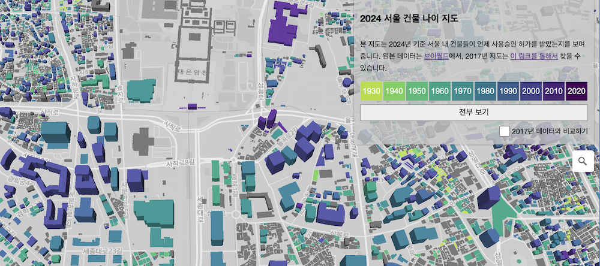

## 2024 서울 건물 나이 지도

 

👉 서울 건물 나이 지도 보기: https://hanbyul-here.github.io/seoul-building-explorer-2024

서울건물나이지도는 건물통합데이터를 기반하여 2024년 기준 서울 내 건물들이 언제 사용승인 허가를 받았는지를 보여줍니다. 원본 데이터는 <a href="https://www.vworld.kr/dtmk/dtmk_ntads_s003.do?dsId=30524&fileNo=2">브이월드</a>에서 찾을 수 있습니다.
